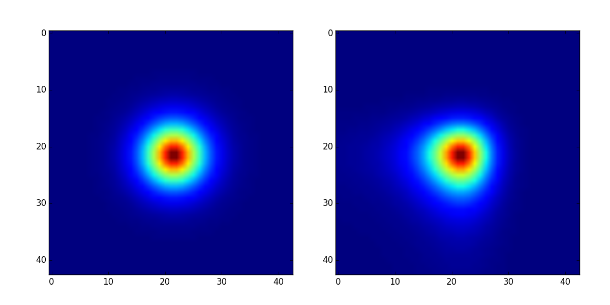
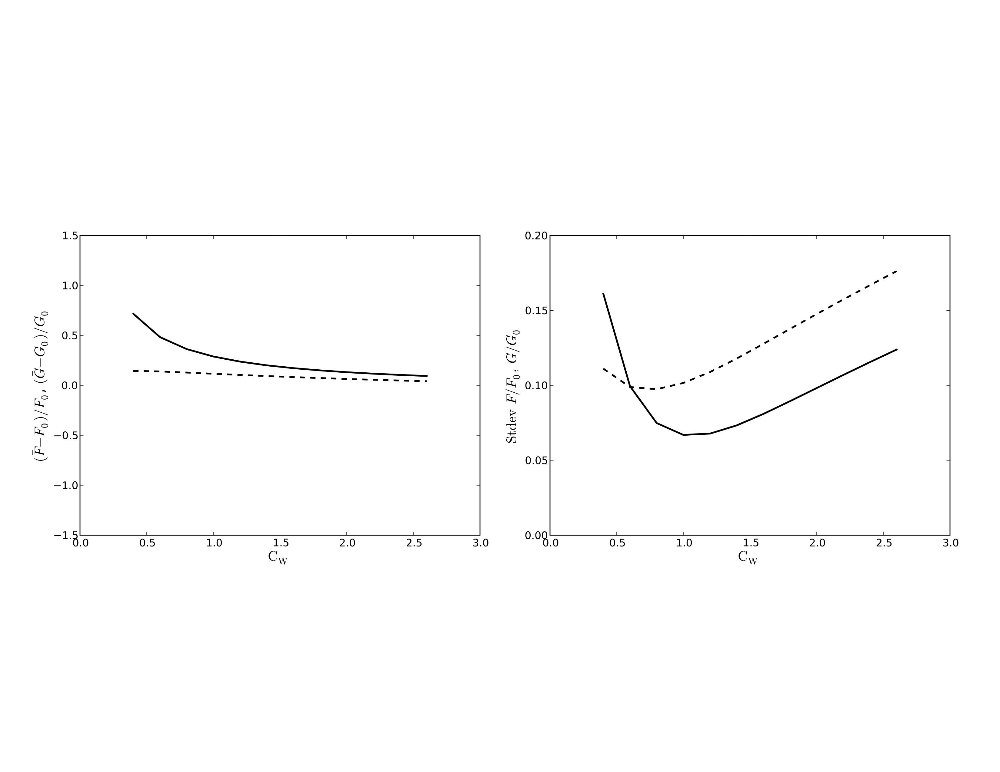

# HOLICs Code for Measuring Flexions in Python

This is a python code for demonstrating how to measurea gravitational lensing flexion. 
This python code is translated from 
[Goldberg's HOLICs code in IDL](http://www.physics.drexel.edu/~goldberg/flexion/).
It includes two parts:
### Ilustrating what flexion is (see Fig. 1).
Use the commend line below to rebuild Fig. 1.
```bash
$ python2.7 show_flexion.py
```


Figure.1: This figure shows an input circle source and its lensed image with flexions. In left panel, it is the unlensed source, which follows perfect circle Gaussian distribution; In right panel, lensed images is shown, the trianglular shape distortion is because of gravitational lensing flexion.

### Measuring flexion and calculate the statistical properties under different size of window functions.
Use the commend line bleow to rebuild Fig. 2.
```bash
$ python2.7 wf_selection.py
```


Figure.2: Figure 2 and Figure 3 in [Goldberg et al 2007](http://arxiv.org/pdf/astro-ph/0607602v2.pdf) can be rebuilt using this python code. 


