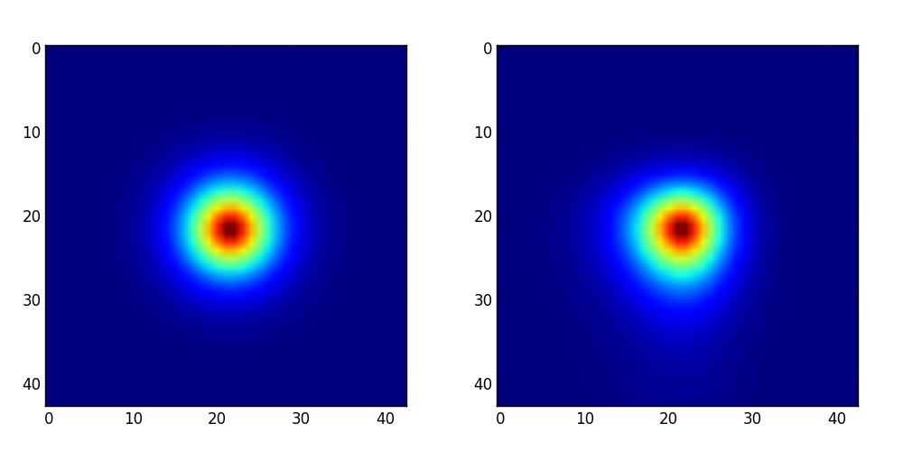

# flexion_holics_python

This is a python code to measure gravitational lensing flexion, it is just a naive version, but it works. 
This python code is translated from 
Goldberg's flexion code in IDL. ( http://www.physics.drexel.edu/~goldberg/flexion/ )



Figure.1: It shows the input simulated lensed image with flexions. In left panel, it is the unlensed source, which follows perfect circle Gaussian distribution; In right panel, lensed images is shown.
```bash
$ python2.7 show_flexion.py
```

Figure.2: Figure 2 and Figure 3 in [Goldberg et al 2007](http://arxiv.org/pdf/astro-ph/0607602v2.pdf) can be rebuilt using this python code. 
```bash
$ python2.7 wf_selection.py
```
